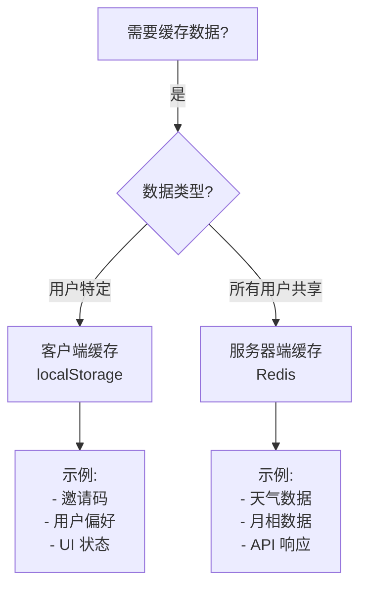

# 缓存架构文档

本项目使用**双层缓存架构**，分别针对客户端和服务器端数据进行优化。

## 📚 目录

- [概述](#概述)
- [客户端缓存 (localStorage)](#客户端缓存-localstorage)
- [服务器端缓存 (Redis)](#服务器端缓存-redis)
- [使用指南](#使用指南)
- [最佳实践](#最佳实践)

---

## 概述

### 双层缓存架构

```
┌─────────────────────────────────────────────────────┐
│                   用户浏览器                          │
│  ┌────────────────────────────────────────────┐     │
│  │  客户端缓存 (localStorage)                  │     │
│  │  - 用户特定数据                             │     │
│  │  - 邀请码、偏好设置                          │     │
│  │  - 客户端持久化                             │     │
│  └────────────────────────────────────────────┘     │
└─────────────────────────────────────────────────────┘
                         ↕
┌─────────────────────────────────────────────────────┐
│                  Next.js 服务器                      │
│  ┌────────────────────────────────────────────┐     │
│  │  服务器端缓存 (Upstash Redis)               │     │
│  │  - 所有用户共享数据                          │     │
│  │  - 天气、月相数据                            │     │
│  │  - 减少外部 API 调用                         │     │
│  └────────────────────────────────────────────┘     │
└─────────────────────────────────────────────────────┘
                         ↕
         ┌──────────────────────────────┐
         │  外部 API (OpenWeather等)      │
         └──────────────────────────────┘
```

---

## 客户端缓存 (localStorage)

### 📁 文件位置
- **实现**: `src/lib/client-cache.ts`
- **使用场景**: 客户端组件、浏览器特定数据

### 🔧 API 函数

#### 1. 获取缓存
```typescript
import { clientCacheGet, cacheGet } from "@/lib/client-cache";

// 推荐使用新名称
const value = clientCacheGet("myKey");

// 向后兼容（Legacy）
const value = cacheGet("myKey");
```

#### 2. 设置缓存
```typescript
import { clientCacheSet, cacheSet } from "@/lib/client-cache";
import { getTimestamp } from "@/lib/time";

// 30 天后过期
const expiresAt = getTimestamp() + (30 * 24 * 60 * 60);
clientCacheSet("myKey", "myValue", expiresAt);

// 永不过期
clientCacheSet("myKey", "myValue", -1);
```

#### 3. 删除缓存
```typescript
import { clientCacheRemove } from "@/lib/client-cache";

clientCacheRemove("myKey");
```

#### 4. 清空所有缓存
```typescript
import { clientCacheClear } from "@/lib/client-cache";

clientCacheClear();
```

### 📊 数据格式

**存储格式**: `{过期时间}:{值}`

**示例**:
```
localStorage["invite_code"] = "1735660800:ABC123"
                               ↑          ↑
                          过期时间戳    实际值
```

### 🎯 当前用途

| 缓存键 | 用途 | 过期时间 | 文件 |
|--------|------|----------|------|
| `InviteCode` | 邀请码 | 30天 | `src/contexts/app.tsx`<br>`src/app/[locale]/(default)/i/[code]/page.tsx` |

### ✅ 特点

- ✅ **客户端持久化**: 页面刷新后数据仍存在
- ✅ **用户隔离**: 每个浏览器独立缓存
- ✅ **自动过期**: 支持时间戳过期机制
- ✅ **无需服务器**: 完全本地运行
- ❌ **仅限字符串**: 不支持对象（需要 JSON 序列化）
- ❌ **不跨设备**: 数据绑定到单个浏览器

---

## 服务器端缓存 (Redis)

### 📁 文件位置
- **客户端**: `src/lib/redis.ts`
- **助手函数**: `src/lib/cache.ts`
- **使用场景**: API 路由、服务器组件

### 🔧 API 函数

#### 1. 通用缓存获取
```typescript
import { getCachedData } from "@/lib/cache";

const data = await getCachedData(
  "cache_key",
  async () => {
    // 数据获取函数（仅在缓存未命中时调用）
    return await fetchFromExternalAPI();
  },
  1800 // TTL: 30 分钟（秒）
);
```

#### 2. 生成天气缓存键
```typescript
import { generateWeatherCacheKey } from "@/lib/cache";

const date = new Date();
const key = generateWeatherCacheKey(date, 52.52, 13.41);
// 结果: "wetter_data:2025-10-18_10_52.52_13.41"
```

#### 3. 生成月相缓存键
```typescript
import { generateMoonCacheKey } from "@/lib/cache";

const date = new Date();
const key = generateMoonCacheKey(date, 52.52, 13.41);
// 结果: "moon_data:2025-10-18_52.52_13.41"
```

#### 4. 手动失效缓存
```typescript
import { invalidateCache } from "@/lib/cache";

await invalidateCache("wetter_data:2025-10-18_10_52.52_13.41");
```

### 📊 缓存键格式

#### 天气数据
```
格式: wetter_data:{日期}_{小时}_{纬度}_{经度}
示例: wetter_data:2025-10-18_10_52.52_13.41
说明: 按小时级缓存，坐标精度 0.01
```

#### 天气预报
```
格式: forecast_wetter_data:{日期}_{小时}_{纬度}_{经度}
示例: forecast_wetter_data:2025-10-18_10_52.52_13.41
说明: 预报数据，TTL 更长
```

#### 月相数据
```
格式: moon_data:{日期}_{纬度}_{经度}
示例: moon_data:2025-10-18_52.52_13.41
说明: 按日期缓存，特定日期数据不变
```

### 🎯 当前用途

| API 路由 | 缓存键 | TTL | 文件 |
|---------|--------|-----|------|
| `/api/weather/current` | `wetter_data:*` | 30分钟 | `src/app/api/weather/current/route.ts` |
| `/api/weather/forecast` | `forecast_wetter_data:*` | 1小时 | `src/app/api/weather/forecast/route.ts` |
| `/api/moon/day-info` | `moon_data:*` | 24小时 | `src/app/api/moon/day-info/route.ts` |

### ✅ 特点

- ✅ **所有用户共享**: 一次查询，多次命中
- ✅ **支持复杂数据**: 自动序列化对象
- ✅ **自动降级**: Redis 未配置时直接调用 API
- ✅ **灵活 TTL**: 根据数据特性设置不同过期时间
- ✅ **性能提升**: 响应时间从 ~500ms 降至 ~50ms
- ✅ **减少成本**: 大幅减少外部 API 调用

---

## 使用指南

### 如何选择使用哪种缓存？



### 客户端缓存示例

```typescript
// src/contexts/app.tsx
import { cacheGet, cacheSet, cacheRemove } from "@/lib/client-cache";
import { getTimestamp } from "@/lib/time";
import { CacheKey } from "@/services/constant";

// 保存邀请码 (30天过期)
const saveInviteCode = (code: string) => {
  const expiresAt = getTimestamp() + (30 * 24 * 60 * 60);
  cacheSet(CacheKey.InviteCode, code, expiresAt);
};

// 读取邀请码
const getInviteCode = (): string | null => {
  return cacheGet(CacheKey.InviteCode);
};

// 删除邀请码
const removeInviteCode = () => {
  cacheRemove(CacheKey.InviteCode);
};
```

### 服务器端缓存示例

```typescript
// src/app/api/weather/current/route.ts
import { getCachedData, generateWeatherCacheKey } from "@/lib/cache";
import { getCurrentWeatherByCoords } from "@/services/weather/openweather";

export async function GET(request: NextRequest) {
  const lat = 52.52;
  const lon = 13.41;

  // 生成缓存键
  const now = new Date();
  const cacheKey = generateWeatherCacheKey(now, lat, lon);

  // 先查缓存，再查 API
  const weatherData = await getCachedData(
    cacheKey,
    () => getCurrentWeatherByCoords(lat, lon, "metric"),
    1800 // 30分钟
  );

  return NextResponse.json({ success: true, data: weatherData });
}
```

---

## 最佳实践

### ✅ 推荐做法

1. **客户端缓存**:
   - ✅ 使用新的 `clientCache*` 命名
   - ✅ 总是设置合理的过期时间（避免 `-1`）
   - ✅ 仅缓存字符串数据
   - ✅ 使用 `CacheKey` 常量避免硬编码

2. **服务器端缓存**:
   - ✅ 根据数据变化频率设置 TTL
   - ✅ 使用助手函数生成缓存键
   - ✅ 处理 Redis 不可用的情况
   - ✅ 记录缓存命中率日志

3. **通用**:
   - ✅ 定期监控缓存使用情况
   - ✅ 文档化所有缓存键
   - ✅ 为敏感数据设置较短 TTL

### ❌ 避免做法

1. **客户端缓存**:
   - ❌ 缓存敏感信息（密码、令牌）
   - ❌ 存储大量数据（localStorage 限制 5-10MB）
   - ❌ 忘记处理过期逻辑

2. **服务器端缓存**:
   - ❌ 缓存用户特定数据
   - ❌ 设置过长的 TTL（数据过时）
   - ❌ 忽略缓存失败错误

### 📝 缓存键命名规范

```typescript
// 推荐格式: {类型}_{数据描述}:{参数}
"wetter_data:2025-10-18_10_52.52_13.41"  // ✅ 清晰
"cache123"                               // ❌ 不清晰
"user_prefs_12345"                       // ✅ 好
"data"                                   // ❌ 太模糊
```

---

## 配置

### 环境变量

```bash
# .env.local

# Upstash Redis (可选 - 不配置时自动降级)
UPSTASH_REDIS_REST_URL="https://your-redis.upstash.io"
UPSTASH_REDIS_REST_TOKEN="your-token-here"
```

### 检查配置

```typescript
import { isRedisConfigured } from "@/lib/redis";

if (isRedisConfigured()) {
  console.log("Redis 已配置 ✅");
} else {
  console.log("Redis 未配置，使用直接 API 调用 ⚠️");
}
```

---

## 监控与调试

### 查看缓存日志

开发环境下，缓存操作会输出日志：

```bash
# 缓存未命中
Cache MISS for key: wetter_data:2025-10-18_10_52.52_13.41

# 数据已缓存
Cached data for key: wetter_data:2025-10-18_10_52.52_13.41 (TTL: 1800s)

# 缓存命中
Cache HIT for key: wetter_data:2025-10-18_10_52.52_13.41
```

### Upstash 控制台

访问 https://console.upstash.com/ 查看：
- 实时命令统计
- 内存使用情况
- 缓存键列表
- 性能指标

---

## 性能指标

### 预期改进

| 指标 | 客户端缓存 | 服务器端缓存 |
|------|------------|--------------|
| 响应时间 | < 1ms | ~50ms (vs ~500ms) |
| API 调用减少 | N/A | 80-95% |
| 数据共享 | 否 | 是 |
| 持久化 | 是 | 是（Redis） |

### 缓存命中率目标

- **客户端**: 90%+ (用户会话内)
- **服务器**: 80-95% (跨用户共享)

---

## 故障排除

### 问题: 客户端缓存不工作

**检查步骤**:
1. 确认是在客户端组件中使用（`"use client"`）
2. 检查浏览器是否允许 localStorage
3. 查看浏览器控制台错误

### 问题: 服务器端缓存未生效

**检查步骤**:
1. 确认环境变量已设置
2. 查看日志是否有 "Redis not configured"
3. 验证 Upstash URL 和 Token 正确性
4. 检查 Upstash 控制台连接状态

### 问题: 数据过期不一致

**原因**: 
- 客户端: 基于时间戳，受本地时间影响
- 服务器: 基于 Redis TTL，不受影响

**建议**: 服务器端数据使用服务器缓存

---

## 总结

双层缓存架构为不同类型的数据提供了最优的缓存策略：

- **客户端缓存**: 快速、用户特定、无需服务器
- **服务器端缓存**: 共享、高效、减少成本

正确使用这两种缓存可以大幅提升应用性能和用户体验。
